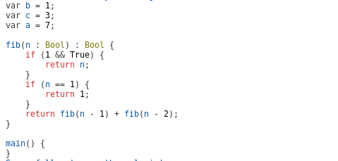
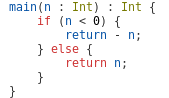
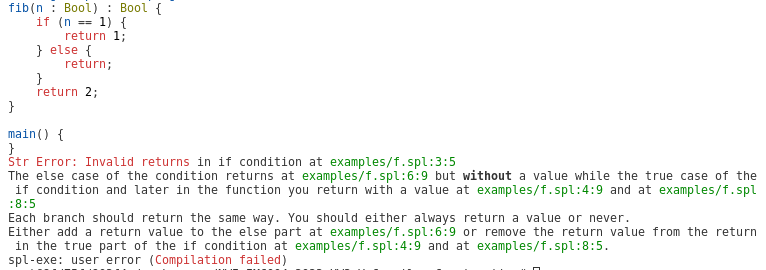
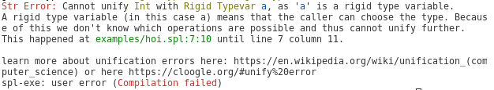

\pagebreak

# Introduction

This report outlines my progress with the SPL compiler.  

The language we will be implementing is called SPL (Simple Programming Language). It is similar to C, but with support for polymorphic datatypes.

Some examples of SPL include:

```spl
fib(n : Int) : Int {
    if (n == 0) {
        return 0;
    }

    if (n == 1) {
        return 1;
    }

    return fib(n - 1) + fib(n - 2);
}
```

You can also ommit the types:

```spl
fac(n) {
    if (n == 0) {
        return 1;
    }

    return n * fac(n - 1);
}
```

but we should still reject wrong programs like:

```spl
fac() {
  var a = 1;
  var b = True;
  return a > b;
}
```

An important thing about SPL is that you can only define variables at the top of a function.
 

## Implementation Language

We went with [Haskell](https://www.haskell.org/) to implement our compiler. We made this choice since it is especially well-suited for compiler construction. Mainly Haskell's support for algebraic data types and its well-suitedness for writing parsers makes it ideal for crafting compilers. 

We also choose Haskell because we wanted to learn it more. This made the first phases of the project quite a bit more difficult because both of our Haskell knowledge was quite rusty. But in the end this project provided an amazing learning opportunity for me to learn loads more about haskell and functional programming in general.
Yes, I have followed the bachelors functional programming course but after implementing the type checker for the compiler (and also taking the advanced programming course) I learned, so much about Haskell. 

I now feel like I actually have an intuition for Monads and Monoids.

# General Architecture

The compiler consists out of multiple phases.
Before we can discuss the phases properly I have to introduce the AST. 

## Abstract Syntax Tree Design 

Our abstract syntax tree is split up into four major inductive types, `Decl`, `Stmt`, `Expr` and `Literal`, with some helper inductives (e.g. for the types and binary operators, unary operators etc) as well. These inductive types have the following meaning:

- `Literal`: for literals (numbers, chars, empy list, tuples, bools ).
- `Stmt`: for statements: 
  - if, else, while, assignment, 
  - return, with a Maybe Expr
  - expressions statements (Expr ';'), an expression with ; behind it; Useful for function calls.
  - BlockStmt, A list of expressions. This is only used during the optimization step. The parser can not make these.
- `Expr`: for expressions (binary and unary expression, variable access, function call, and literal expressions);
- `Decl`: for declarations. Functions, global variables, and also function variables at the start of the function.
  - We started out with different nodes for global variables and function declarations, but we made function declarations the same as the global ones once we noted a lot of duplicated code.
- `Program`: just a type synonym for a list of Decl `[Decl]`.

A special data type we made was the type data type. We use this data type both for the types in the AST and to represent the types in the type checker.
We have the following types:

```hs
data Type = IntType
  | CharType
  | BoolType
  | VoidType
  | TupleType Type Type
  | ListType Type
  | TypeVar { typevarname :: String, rigid :: Bool }
  | FunType [Type] Type
```

### Designing the abstract syntax tree

We designed the abstract syntax tree immediately the first week. It was the first thing that we did in the project, and we spent quite some time on it. We used a bottom-up approach to construct the AST. So we went from We started with the simple constructs (literals) and worked up to larger constructs such as function declarations. The program is a list of function and variable declarations. At every step we added the additional nodes we needed. Like a BinOp type for binary expressions or Type data type. 

Since we did not have a grammar yet, we looked at the available examples in the GitLab repository to figure out the syntax of SPL. We used our AST as a grammer for the most part, but we did write an extended BNF grammer in the appendix.

## Trees that grow

We wanted a flexible system to annotate trees with additional metadata that extends to the multiple phases of the compiler. To achieve this, we have implemented a variation of Trees that Grow [@DBLP:journals/corr/NajdJ16]. 

The approach to annotate our AST is based on type families. This works by adding a parameter to each (relevant) `data` type that determines the phase of the compiler. Using type families you can create seperate instances of `data` based on the phase of the compiler while keeping the general structure of the AST the same. Without type families you would need to build a seperate similar but distint trees for every phase of the compiler.

In essence this allows me to use the same `data` for every phase of the compiler but some parts of the data will actually have different types depending on the phase of the compiler we are in. This brings many benefits:

- No separate data types for every node of the AST for every phase of the compiler. 
- Anyone can easily extend parts of the tree later.
- You can enforce the order of the phases of the compiler at the type leve. 
Like for instance the only way to get an `Program TypecheckedP` is first calling the parser to get an `Program ParsedP` and then you have to give that to the returns checker which only takes `Program ParsedP` and turns them into `Program ReturnsCheckedP`. 
Only then can you give that `Expr ReturnsCheckedP` to the type checker which only takes `Program ReturnsCheckedP` and gives back a `Program TypecheckedP`.

The type of `Program` is `type Program (p :: Phase) = [Decl p]`.

By using the `DataKinds` language extension, the phase is also a `data` type:

```hs
{- All the different phases of the compiler -}
data Phase
  = EmptyP        -- Empty phase, used for testing
  | ParsedP       -- Phase after parsing with location information
  | ReturnsCheckedP -- Phase after the retuns have been checked
  | TypecheckedP  -- Phase after full typechecking
```

Next, we add to each constructor of the `data` type a new field that has a type family with the phase as its typed. Since type families are functions from type to type, we can control the actual type of that field through the phase.

To explain this concept fully, we will look at how to implement this approach for a simplified version of expressions in SPL, where only binary expressions and literals are allowed. We start with the naive approach of using separate `data` types for each phase, then we introduce type families.

```hs
data ExprEmpty
  = BinOpExprEmpty BinOp ExprEmpty ExprEmpty
  | LiteralExprEmpty Literal

data ExprParsed
  = BinOpExprParsed SourcePos BinOp ExprParsed ExprParsed
  | LiteralExprParsed SourcePos Literal

data ExprTypechecked
  = BinOpExprTypechecked SourcePos Type BinOp ExprTypechecked ExprTypechecked
  | LiteralExprTypechecked SourcePos Type Literal 
```

The above approach is clumpsy, and requires us to make modifications in many places to make changes to the AST, since it requires us to keep all these different `data` types in sync. Additionally, it forces us to use long names for the different data constructors and makes it impossible to make functions that work on generic ASTs (e.g. functions that are agnostic to the phase of the AST).

Trees that Grow [@DBLP:journals/corr/NajdJ16] solves this by introducing a type family, which is a function from type to type, for each field of the `data` type. The only argument to these type families will be the phase of the AST. The type families for this example will therefore be:

```hs
type family BinOpExpr (p :: Phase)
type family LiteralExpr (p :: Phase)
```

Any fields specific to a particular phase of the compiler will then be replaced by a field of the associated type family, like so:

```hs
data Expr (p :: Phase)
  = BinOpExpr (BinOpExpr p) BinOp (Expr p) (Expr p)
  | LiteralExpr (LiteralExpr p) Literal
```

Finally, for each phase we can create an instance of the type family that determines the actual type for that field:

```hs
type instance BinOpExpr EmptyP = ()
type instance BinOpExpr ParsedP = SourcePos
type instance BinOpExpr ReturnsCheckedP = SourcePos
type instance BinOpExpr TypecheckedP = (SourcePos, Type)

type instance LiteralExpr EmptyP = ()
type instance LiteralExpr ParsedP = SourcePos
type instance BinOpExpr ReturnsCheckedP = SourcePos
type instance LiteralExpr TypecheckedP = (SourcePos, Type)
```

This gives us a lot of control over the actual contents of the AST for each type, since it allows us to assign a different type for each constructor in the AST for each phase of the compiler, while keeping the overall structure of the AST identical. Furthermore, it allows us to write functions that work on any phase by simply ignoring the field with the type family.

### Disadvantages of using type families

After having implemented a lot more of the compiler I want to report some of the disadvantages of using type families in this way.

The annoying thing is that Haskell just can't inference that two instances of a type family can actually be of the same type.
Like for instance with:

```
type instance LiteralExpr ParsedP = SourcePos
type instance BinOpExpr ReturnsCheckedP = SourcePos
```

Even if a node with a phase is always the same Haskell still does not know. 
This means that you can not touch the contents of the nodes, and you can not convert them with identity.
`Literal ParsedP -> Literal ReturnsCheckedP` can not be `id`.

To solve this I made a type class to convert a data to the next phase if the transformation is trivial (basically id).

```hs
{- Start of type familiy instance convertable -}
class Convertable n (p1 :: Phase) (p2 :: Phase) where
  -- We use this to explicitly change the phase of a node in a case that it won't fail anyway
  -- convert :: n p1 -> n p2
  upgrade :: n p1 -> n p2 -- Same name but upgrade makes more sense because your moving on 
  -- This is great because it works if the shape is the same!
```

You then recursively apply this to a node to upgrade it to the next phase. 
For instance during type checking I currently do not change the expression and statements so for those nodes I can just call `upgrade`.

This is a good solution, but it adds a lot of boilerplate. 
Even though this `upgrade` function is really trivial all the instances together are still more or less 200 lines of Haskell code.

When deriving type classes like Show and Eq you still have to do it for every possible instance of the ast. This also adds a lot of boilerplate.

When you want to have a type class that can work on multiple phases of the compiler like:

```hs
class Prettier a where
  {-# MINIMAL pretty #-}
  pretty :: a -> String
  prettyBrief :: a -> String
  prettyBrief = pretty
```

You still need to implement it for every phase separately. Even though in reality the actual types of `UnaryOpExpr p` are all the same.
At least here the upgrade function helps a little but because you can just `upgrade` most things to the latest phase (in this case TypecheckedP), and only implement pretty for that. 

Later I learned about [unsafeCoerce](https://hackage.haskell.org/package/base-4.20.0.1/docs/Unsafe-Coerce.html#v:unsafeCoerce) which probably would have worked as well.

# Phases of the compiler

The compiler currently consists out of the following phases:

1. Reading the input file
2. Lexical Analysis; No separate lexing step but just in time lexing. (AST now has `ParsedP` fase)
3. Check if the `Program` has a `FunDecl` with name `"main"`.  
4. Preprocessing
   1. Remove dead code
   2. Hoist global variable declarations 
5. Pretty print the program
6. Check uniform return statements (AST now has `ReturnsCheckedP``)
7. Check for duplicate declarations 
8. Type checking 
9. Optimizing
10. Code generation

# Reading the input file

In this phase we parse the command line arguments and read the file with the code as a string. 
The only other command line argument at the moment is `-o` for the output file name.

# Lexical analyses

This section describes the lexical analyses phase of the compiler.

## The parser

We use parser combinators for parsing. We started with building our own parser combinators. While this was a good learning experience,  we soon realized this would require a significant amount of work and would make it much more difficult to get good error messages. Therefore, we decided that using more mature tools (e.g. an existing parser combinator library) would give us more time to work on cool extensions. 

Therefore, we switched to the parser combinator library [megaparsec](https://hackage.haskell.org/package/megaparsec), which is the (informal) successor of [parsec](https://hackage.haskell.org/package/parsec). To become more familiar with the libary, and for occasional tips, we used [this excellent tutorial by Mark Karpov](https://markkarpov.com/tutorial/megaparsec.html), the maintainer of megaparsec.

Parser combinators work through *function composition*, where we take very simple parsers (such as "parse a single character") and compose these together to create more complicated parsers (such as "parse the word 'parser'"). This composition usually happens through helper functions, defined by megaparsec, that take zero or more parsers, and construct a new (bigger) parser. For example, the `<|>` combinator takes two parsers, and constructs a new parser that first tries the parser on the left, and if it fails tries the parser on the right. A large part of the internal mechanics of parser combinators, such as carrying error messages, are hidden away in the `Parser` type.

Since parsers in megaparsec are also part of a number of useful typeclasses, such as Monad, we can use a number of useful combinators Haskell itself provides to compose parsers (e.g. `do` notation, `many`, `some` and `<$>`).

## Handling associativity

Since we use the megaparsec library, we get quite a number of things for free, such as error handling and associativity. Megaparsec also provides us with the helper function `makeExprParser` that, given an operator table and a parser for terms (e.g. any expression that does not have an operator, such as literals), constructs a parser that has the specified operators in the specified order or precedence and with the specified associativity. We are using this `makeExprParser` function.

Our operator table is as follows:

```haskell
operatorTable =
   [ [ Postfix (unary (FieldAccess HeadField) (try (L.tDot <* L.tHead)))
      , Postfix (unary (FieldAccess TailField) (try (L.tDot <* L.tTail)))
      , Postfix (unary (FieldAccess SecondField) (try (L.tDot <* L.tSnd)))
      , Postfix (unary (FieldAccess FirstField) (try (L.tDot <* L.tFst)))
      ]
    , [ Prefix (unary Negate L.tExcl)
      ]
    , [ InfixL (binary Mul L.tStar)
      , InfixL (binary Div L.tSlash)
      , InfixL (binary Mod L.tPercent)
      ]
    , [ InfixL (binary Add L.tPlus)
      , InfixL (binary Sub L.tMin)
      , Prefix (unary Min L.tMin)
      ]
    , [ InfixR (binary Cons L.tColon)]
    , [
        InfixN (binary Gte L.tGte) -- Gte and Lte have to go before > and < because otherwise it thinks its = after
      , InfixN (binary Gt L.tGt)
      , InfixN (binary Lte L.tLte)
      , InfixN (binary Lt L.tLt)
      , InfixN (binary Eq L.tDoubleEq)
      , InfixN (binary Neq L.tExclEq)
      ]
    , [ InfixR $ binary And L.tDoubleAmpersand  ]
    , [ InfixR $ binary Or L.tDoublePipe ]
    ]
```

The operator table is ordered in decreasing precedence (i.e. the higher in the list, the greater the binding strength of the set of operators). Any operators in the same sublist have the same precedence. Associativity can be modified using the constructors from the `Operator` datatype, which supports:

- `InfixN`: for non-associative infix operators;
- `InfixL`: for left-associative infix operators;
- `InfixR`: for right-associative infix operators;
- `Prefix`: for prefix operators;
- `Postfix`: for postfix operators.

We chose the same precedence and associativity as Haskell ([source](https://rosettacode.org/wiki/Operator_precedence#Haskell)). We also use the `makeExprParser` for the field access operators (`.hd` and `.tl`) for lists and (`.fst` and `.snd`) for tuples as this was the easiest solution.

## Error handling

Error handling is handled by megaparsec, which, out of the box gives quite good error messages. For example:

```
test.spl:1:7:
  |
1 | (a + b
  |       ^
unexpected end of input
expecting "!=", "&&", "<=", "==", ">=", "||", '!', 
'%', ''', ')', '*', '+', ',', '-', '/', ':', '<', '>', '_', or alphanumeric character
```

Megaparsec also supports [custom error messages](https://markkarpov.com/tutorial/megaparsec.html#parse-errors) and [error recovery](https://markkarpov.com/tutorial/megaparsec.html#reporting-multiple-parse-errors), but we have not implemented those yet.

## Lexer

We do not have a seperate lexing step. Instead, we use a (what we call) just-in-time lexer (scannerless). Our lexer is just a collection of regular parsers that only parse simple tokens (as a regular lexer would), such as keywords, identifiers or symbols, while discarding whitespace and comments. In megaparsec, whitespace is only discarded at the end of tokens in the lexer. This is why our main program parser has an additional "whitespace" parser at the start to discard comments and whitespace at the beginning of files as well.

"Lexing" is mostly done using the `symbol` parser combinator, which takes any string and creates a parser that parses exactly that string, while throwing away comments and whitespace at the end. For example, `symbol "a"` should parse `a`, but also `a/* comment */`.

We use these lexer parsers all throughout the rest of the parser, in places where you would normally consume a token with a regular parser. We chose this approach, since it is well-supported by megaparsec and it just easily deals with any comments and whitespace as soon as you use the symbol parser. Eventhough megaparsec does work on arbitrary input streams (including user-defined tokens), you cannot use a large part of the predefined parsers created by the megaparsec community. We do not see a benefit of converting the whole input into tokens first when using parser combinators.
`

### Problems

Since we started with writing the AST in Haskell based on the examples in the repo, we did not have any major problems during this phase. Having a well-defined AST early on really helped us make the parsers, as we were able to start from the most simple parsers (such as literals), and easily work our way upwards.

We initially did struggle with the left-recusivity of property access (e.g. `a.hd`), but fixed this by making `.hd` and `.tl` postfix operators in the `makeExprParser`. This fixes the left-recursion, as megaparsec will only parse things with lower precedence on the left, causing it to no longer be fully recursive.

We also wrote many tests for our parsers from the start, which helped reduce bugs.


# Preprocessing

## Remove Dead Code
In step 2.1 we remove dead code by looking for certain patterns in lists of statements. 
If we see a return statement we just don't recurse on the tail of the list of statements and just return the `return` statement. 

We do the same for when there is an if statement that also have an else statement and both blocks return. For this I implemented a function called `returns` which can find out if a list of arbitrary statements returns without, with a value or does not return at all. See the section about the returns checking for more information about this function.

## Hoist global variable declarations

In this phase we put all the variable declarations on top of the program. 
This allows the programmer to define the global variables after functions, and it will still work well with the type checker.

We perform this step by sorting the `Program` and saying that a `FunDecl` is `LT` then a `VarDecl`.

## Example

After preprocessing a program like this:

```spl
var b = 1;

fib(n : Bool) : Bool {
    if (1 && True) {
        return n;
    }

    if (n == 1) {
        return 1;
    }

    return fib(n - 1) + fib(n - 2);
    n = 3;
    n = 3;
    n = 3;
}

var c = 3;
var a = 7;

main() {}
```

will look like:

```spl
var b = 1;
var c = 3;
var a = 7;

fib(n : Bool) : Bool {
    if (1 && True) {
        return n;
    }
    if (n == 1) {
        return 1;
    }
    return fib(n - 1) + fib(n - 2);
}

main() {
}
```
At the end of this step we also print how much the ast shrunk as a result of the dead code removal. 

# Pretty printing

I have implemented a pretty printer.
The same program from the previous section is printed like this:



I also made a brief version of the pretty printer which tries prints shorter versions of the program. Mainly just less new lines.

## Syntax Highlighting 

As you can see it also does colors for different types of things in the ast.
This has been very helpful during debugging. Especially this example:



At this point I had not added a unary `-` yet so this got parsed as a binary minus expression where the left is a variable called `return`.
I could immediately see this because the color of the return changed from red for statements to blue for variable and function names.

Colors are printed in yellow, paths are always printed in green and literals are always black. The rest of the syntax is `}`.

Ofcourse when printing to a file these colors are really annoying because they are all [ansi codes](https://en.wikipedia.org/wiki/ANSI_escape_code) for shells like this: 
`"\\ESC[;31m"` which happens to make everything after it red. You can reset colors with `"\\ESC[0m"`. In a file you 
However, since comments are not included in the AST, our pretty printer strips comments, and can therefore not realistically be used for formatting anyway. 

I made some nice functions that take a single string and insert a color at the start and the reset at the end. 
I found that adding these colors also improved the readability of the error messages by a lot.

# Check for a main function

This is the simplest phase of them all. We just iterate over the decls and check if there is a function declaration with name "main".

The nice thing about this phase is that this function can actually be applied to every phase because it doesn't need to touch nodes that need a phase.
  What I mean is that with `FunDecl a` the name is still just `String`.

#  Check uniform return statements (AST now has `ReturnsCheckedP``)

During this phase we check if all paths in the list of statements return in the same way. 
We don't check if they return the same type but just the same way. This way the type checker can assume that this is the case later.
Because it is needed for the type checker to know this, I decided to upgrade the `Phase` in this step. 
Luckily it was trivial because nothing in the ast actually changed, so I could just map upgrade over the decls. 

For this step I specified this type `data TypeOfRet = WithValue SourceSpan | WithoutValue SourceSpan | No` 
and a recursive function that checks for the return way of every statement. 
The return statement is a base case for this function and the if else statement can be based on the `TypeOfRet` of the body of the if else and tail of the list of statements. I did a large case statement for all the different options you can have with an if else. The other statements where simpler.

Basically the rule is that WithoutValue and No are both compatible so no error but WithValue is not competible with the other two.
So if you see a WithValue in the true case of an if and a WithoutValue in the else case this is an error.

I spend a decent amount of time writing nice error messages for this phase that tell you exactly what happened.

```spl
fib(n : Bool) : Bool {
    if (n == 1) {
        return 1;
    } else {
        return;
    }
    return 2;
}

main() {
}
```

```text
Str Error: Invalid returns in if condition at examples/f.spl:3:5
The else case of the condition returns at examples/f.spl:6:9 but without a value while the true case of 
the if condition and later in the function you return with a value at examples/f.spl:4:9 and at examples/f.spl:8:5

Each branch should return the same way. You should either always return a value or never.
Either add a return value to the else part at examples/f.spl:6:9 or remove the return value 
from the return in the true part of the if condition at examples/f.spl:4:9 and at examples/f.spl:8:5.
spl-exe: user error (Compilation failed)
```




# Check for duplicate declarations 

This phase checks if any declaration is made twice. It does this with separate environments for function names, global variables and function variable declarations.

[Duplicate variable](duplicate_decl.png)

# Type checking 

The type checking was by far the hardest and most exciting part of this project.
I based implementation of on Hindley–Milner type system from the AlogithmW paper. 
I started out by following the tutorial paper. 

It took me a while to get to this stage with many ahha moments, but I really enjoyed it.


## We define a type class for type instance like so:

```hs
class Typecheck a where
  {-# MINIMAL tc | ti #-}
  tc :: a -> Type -> TI Subst
  tc a t = do
    (s1, inferredT) <- ti a
    s2 <- unify t inferredT
    let s = s1 `composeSubst` s2
    applySubToTIenv s
    return s
  ti :: a -> TI (Subst, Type)
  ti a = do
    t <- newTyVar
    s <- tc a t
    applySubToTIenv s
    return (s, apply s t)
```

This allows us to only implement one of the functions out of tc and ti, and then we get the other one for free.

We implemented type inference for every node in the ast. Here is our unify function.

```hs
varBind :: SourceSpan -> String -> Type -> TI Subst
varBind meta u t
  | u `Set.member` typevars t =
      throwError $
        red "Occurs check:" ++ " cannot construct the infinite type 
              " ++ u ++ " ~ " ++ show t ++ " at " ++ showStart meta
  | otherwise = return (Map.singleton u t)

-- todo, we could also include variables names here maybe
-- Based on the variables in the varenv we could do suggestions of types to use!!
unify :: Type -> Type -> TI Subst -- Are 2 types be the same?
unify (FunType args r) (FunType args' r') = do
  -- We need to unify all the arguments from l with l' pair by pair
  -- No I would have never have known that witout the hint thing from vscode
  s1 <- zipWithM unify args args' -- same as: mapM (uncurry unify) (zip at at') 
  let s1' = foldr composeSubst nullSubst s1
  s2 <- unify (apply s1' r) (apply s1' r')
  return $ s1' `composeSubst` s2
unify  (TypeVar u1 False) t2@(TypeVar _ False) = return $ Map.fromList [(u1, t2)]  
unify  (TypeVar u False) t = gets currentMeta >>= \meta -> varBind meta u t -- bind the type var!
unify t (TypeVar u False) = gets currentMeta >>= \meta -> varBind meta u t
unify ty1@(TypeVar name1 True) ty2@(TypeVar name2 True) = if name1 == name2 
                                                           then return nullSubst else unifyError ty1 ty2
unify ty1@(TypeVar _ True) ty2 = unifyError ty1 ty2
unify ty1 ty2@(TypeVar _ True) = unifyError ty1 ty2
unify (ListType t1) (ListType t2) = unify t1 t2
unify (TupleType t1 t2) (TupleType t1' t2') = do
  s1 <- unify t1 t1'
  s2 <- unify (apply s1 t2) (apply s1 t2')
  let s = s1 `composeSubst` s2
  applySubToTIenv s
  return s
unify IntType IntType = return nullSubst
unify BoolType BoolType = return nullSubst
unify CharType CharType = return nullSubst
unify VoidType VoidType = return nullSubst
unify t1 t2 = unifyError t1 t2
```

The TI monad looks like this:

```hs
TIenv = TIenv {currentFunEnv :: FunEnv, -- Map String Shceme
  currentVarEnv :: VarEnv,
  currentMeta :: SourceSpan,
  currentFunName :: Maybe String, -- Just for error messages
  -- currentFunGroup :: Map String Type, -- All functions in the current group that we are checking, 
        this is half way because we need to also only apply at the end
  currentFunType :: Maybe Type,
  currentFunArgNames :: Maybe [String],
  currentTypeVarCounter :: Int,
  funCallRecord :: Map (String, [Type]) String, -- Function name, 
     -- list of arguments and the name to replace it with.
  currentGlobalVarNames :: Set.Set String
  -- functionsToGenerate :: 
}

type TIState = TIenv

type TI a = ExceptT String (State TIState) a
```

We track many things in this monad. 
This allows for making nice error messages. 
The main thing being that we should not instantiate a type scheme for the function your checking but get the type directly from the environment. 

What really caused big trouble is that the type nodes where Maybe in ParsedP, and I was trying to resolve that in the same function
as the function that called ti on the decls. This added a bunch of complexity but only yesterday I found out that THIS was the source of it.

The problem was that all the ti functions got a maybe type and instantiated a new typevar in the ti if it was Nothing. 
But because ti does not return an ast node I had to redo this later when I was applying the substitution to the decls. 
But then you get different type variables of course. 

No I do that before the actual type checking. 

The more and more I worked on the type checker the simpler the code became. But this simplicity is very hard to reach at once. 

In the end I ended up with this:

```hs
checkDecls :: Program TypecheckedP -> TI (Program TypecheckedP)
checkDecls [] = return []
checkDecls (decl:future) = do
  (sub, ty) <- ti decl
  solved <- checkDecls future
  return $ apply sub decl : solved
```

It started out with much more code.

## Error messages

In this phase I also spend a lot of time on the error messages. Here is an example.



There are many more.

I also included some runtime error messages. 
A cool feature of these is that the code will still keep the connection to the original file. 
So `[].hd` will say where this out of bounds error happened in the file.

### Polymorphism

One of the types we have is type var. We added a boolean to this type to indicate the type var is rigid or not.
The only way to get rigid type variables is from the parser. After that a rigid type var can only be unified with another rigid type var with the same name.
The idea was to only lift this restriction in function args and to then record the function calls but this is not implemented. 

## Overloading

We will probably not implement overloading except for the print function.

## Problems

- Mutual recursion is not implemented, we now generate code by first generating code for all the var decls, then the funcdecls in order from top down.
- Specializing functions after type inference by collecting all the different invocations when type checking the function call expression. 

# Optimizing

During this phase we prune and evaluate parts of the tree so that we have to generate less code.
I actually implemented a lot of things here. 

- Literal evaluation for binary and unary operations.
- Lazy boolean expressions, meaning that if in an `&&` expression one of the bools is true I just replace it with a `True` lit.
- Remove while (false)
- Remove if (false) and always run the else

In the last two cases I replace the statements with a BlockStatement which I later merge into the main statement list.


# Code generation 

We are not very far yet on the code generation. We implemented a data with every SSM instruction and WASM instruction as data. 
We implemented Monoid for these data so that the instructions can be chained together with the `<>` operator and a state monad that has the current variables.

Then we made a type class called `GenSSM` and `GenWASM` with a single generate function that takes an environment and an AST node that implements the type generate class.

We will implement the lists as linked list in the memory. This allows us to implement the cons operator with a single instruction `STMH 2`. 
We will then just only put the address of the list into the stack. This way every variable on the stack will be the same size.

I implemented code generation for literals, binary expressions, unary expressions and function calls without arguments.

## Testing

For testing, we use the testing library [hspec](https://hackage.haskell.org/package/hspec), which has great support for megaparsec through the [hspec-megaparsec](https://hackage.haskell.org/package/hspec-megaparsec) library.

These tests really helped during the start of development, as we were able to find bugs quickly.
Especially for the parsing. However, during the type checking things kept changing too much to add and update the tests so I did not keep up with this.

## Extensions 

I have implemented tuples and string literals. The string literals are just syntactic suger for the parsing but the tuple is an actual thing in the ast which is also type checked.

- Print can also be called without arguments to just print a new line
- Added a `TRAP 2` to ssm to print char arrays.

# Appendix

## Grammar

| Symbol  | Meaning                                |
|---------|----------------------------------------|
| `|`     | or                                     |
| `'if'`  | literal string                         |
| `'\''`  | literal single quote                   |
| `[ a ]` | should appear 0 or 1 time              |
| `a*`    | should appear 0 or more times          |
| `a+`    | should appear 1 or more times          |

```
Program = Decl+

Type =
    | 'Int'             
    | 'Char'
    | 'Bool'
    | 'Void'
    | '(' Identifier ',' Identifier ')'
    | '[' Identifier ']'
    | Identifier  -- a

Decl =
    Identifier '(' [Identifier [':' Type]  
                [',' Identifier [':' Type] ]* ] ')' [':' Type] '{' Stmt* '}'
    [Type] Identifier '=' Expr ';'

Stmt =
    | 'return' [Expr] ';'
    | 'if' '(' Expr ')' '{' Stmt* '}' [else '{' Stmt* '}']
    | 'while' '(' Expr ')' '{' Stmt* '}'               
    | Variable '=' Expr ';'
    | Expr  ';'
    | 'var' [Type] Identifier Expr  ';'

Expr =
    | Expr BinOp Expr
    | UnaryPrefix Expr
    | UnaryPostfix Expr
    | Identifier '(' ')'
    | Identifier '(' Expr [',' Expr]* ')'
    | Variable              
    | Literal             

UnaryPrefix = 
    | '!'
    | '-'

UnaryPostfix =
    | '.' Field

BinOp =
    | '*'
    | '/'
    | '%'
    | '+'
    | '-'
    | ':'
    | '>'
    | '>='
    | '<'
    | '<='
    | '=='
    | '!='
    | '&&'
    | '||'

Variable = Identifier ['.' Field]

Field =
    | 'hd'
    | 'tl'
    | 'snd'
    | 'fst'

Literal =
    | 'true'
    | 'false'
    | Int            
    | Char          
    | '('Expr ',' Expr')' 
    | '[]' 

Char = ''' UnicodeChar '''
Float = [ '-' | '+' ] Int '.' Int
Int = [ '-' | '+' ] digit+
Identifier = (alphaNumLower | '_') (alphaNum | '_') '\''*
```

# Bibliography

